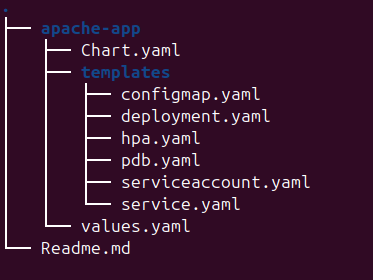

# Reusable Helm Chart for Microservices

A single Helm chart that can deploy multiple microservices by changing configmap values.

## Directory Structure



## Steps for running the project
1. Clone the repo
    ```sh
    git clone https://github.com/vardhan249/Helm-implementation-for-2-microservice.git
    ```
    
2. Installation of K3's and Helm
    
    ```
    curl -sfL https://get.k3s.io | sh -
    ```
    ```
    sudo k3s kubectl get nodes
    ```
    ```
    curl -fsSL -o get_helm.sh https://raw.githubusercontent.com/helm/helm/main/scripts/get-helm-3
    ```
    ```
    chmod 700 get_helm.sh
    ```
    ```
    ./get_helm.sh
    ```
3. Install metrics server on the cluster and disable TLS connection
    ```sh
    sudo k3s kubectl apply -f https://github.com/kubernetes-sigs/metrics-server/releases/latest/download/components.
    ```
    ```sh
    sudo k3s kubectl patch deployment metrics-server -n kube-system   --type='json' -p='[{"op":"add","path":"/spec/template/spec/containers/0/args/-","value":"--kubelet-insecure-tls"}]'
    ```
4. Install Helm Chart
    ```sh
    cd apache-app
    sudo helm install apache-test .
    ```
    This will create the deployment as well as nodeport service on nodeport `30081` and `30082` configurable in values.yaml.
    
5. Upgrade the Helm Chart by changing the configmap
    ```sh
    sudo helm upgrade apache-test apache-app/ --set configMap.service1Content="Service A Updated to v2" --set configMap.service2Content="Service B Updated to v2"
    ```
 
6. Rollback to the older version   
    ```
    sudo helm rollback apache-test
    ```
7. Check Helm history

    ```
    sudo helm history apache-test
    ```

8. Check the status of the HPA
    ```sh
    sudo k3s kubectl get hpa
    ```
